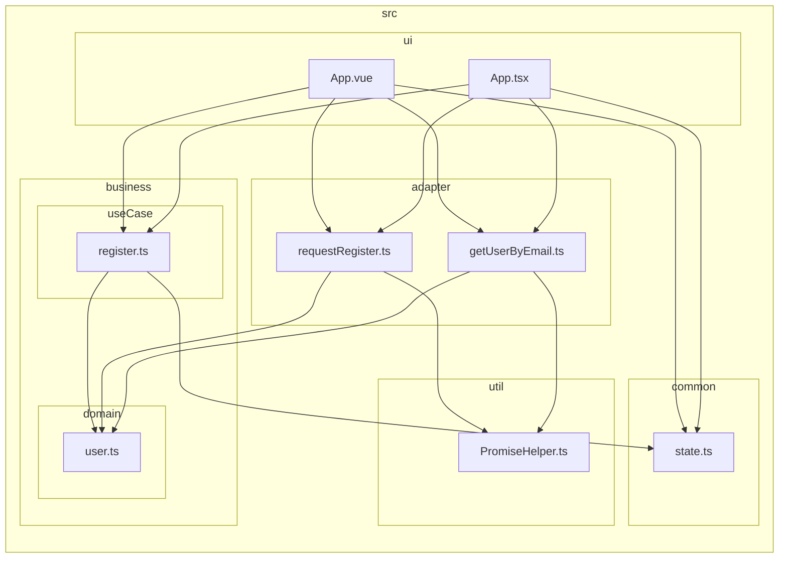

## Architecture

```mermaid
flowchart LR

subgraph 0["src"]
subgraph 1["adapter"]
2["getUserByEmail.ts"]
8["requestRegister.ts"]
end
subgraph 3["business"]
subgraph 4["domain"]
5["user.ts"]
end
subgraph 9["useCase"]
A["register.ts"]
end
end
subgraph 6["util"]
7["PromiseHelper.ts"]
end
subgraph B["common"]
C["state.ts"]
end
subgraph D["ui"]
E["App.tsx"]
F["App.vue"]
end
end
2-->5
2-->7
8-->5
8-->7
A-->C
A-->5
E-->2
E-->8
E-->A
E-->C
F-->2
F-->8
F-->A
F-->C
```
