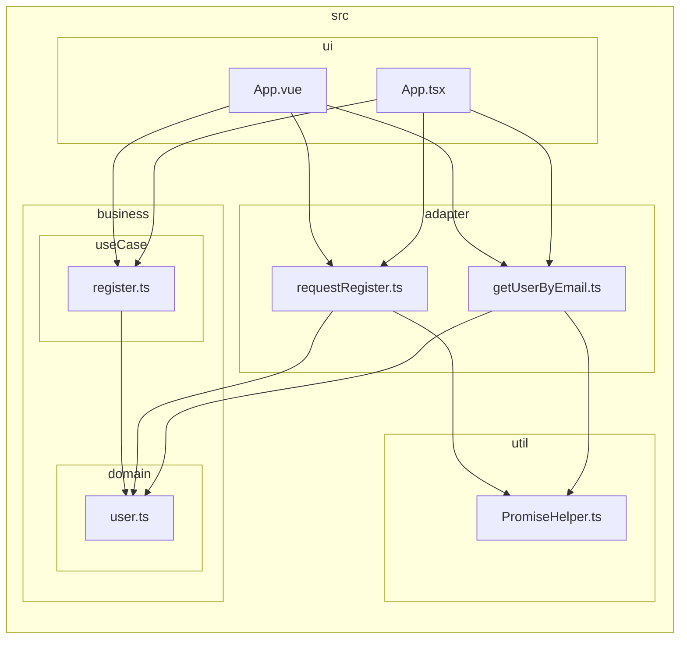

# Dependency Graph

```mermaid
flowchart LR

subgraph 0["src"]
subgraph 1["adapter"]
2["getUserByEmail.ts"]
8["requestRegister.ts"]
end
subgraph 3["business"]
subgraph 4["domain"]
5["user.ts"]
end
subgraph 9["useCase"]
A["register.ts"]
end
end
subgraph 6["util"]
7["PromiseHelper.ts"]
end
subgraph B["ui"]
C["App.tsx"]
D["App.vue"]
end
end
2-->5
2-->7
8-->5
8-->7
A-->5
C-->2
C-->8
C-->A
D-->2
D-->8
D-->A
```
