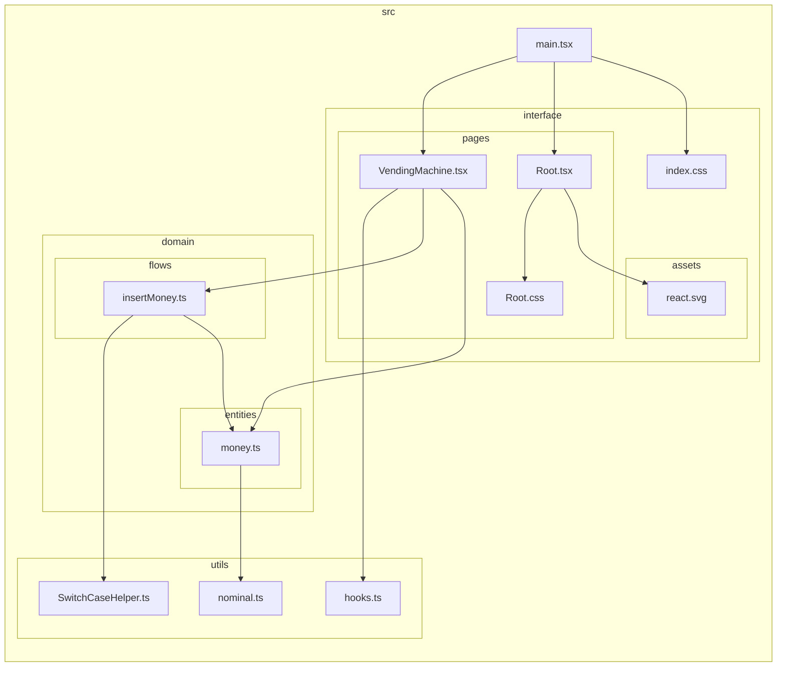

# Architecture

```mermaid
flowchart LR

subgraph 0["src"]
subgraph 1["domain"]
subgraph 2["entities"]
3["money.ts"]
end
subgraph 6["flows"]
7["insertMoney.ts"]
end
end
subgraph 4["utils"]
5["nominal.ts"]
8["SwitchCaseHelper.ts"]
G["hooks.ts"]
end
subgraph 9["interface"]
subgraph A["pages"]
B["Root.tsx"]
E["Root.css"]
F["VendingMachine.tsx"]
end
subgraph C["assets"]
D["react.svg"]
end
I["index.css"]
end
H["main.tsx"]
end
3-->5
7-->3
7-->8
B-->D
B-->E
F-->3
F-->7
F-->G
H-->I
H-->B
H-->F
```
