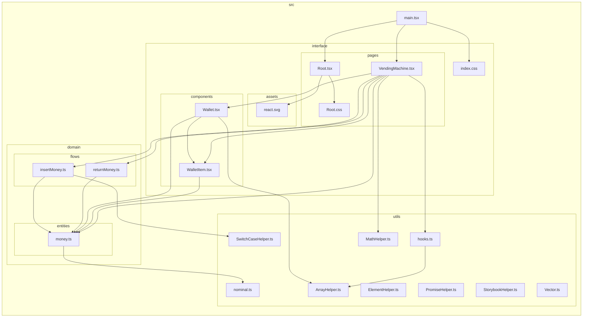

# Architecture

```mermaid
flowchart LR

subgraph 0["src"]
subgraph 1["domain"]
subgraph 2["entities"]
3["money.ts"]
end
subgraph 6["flows"]
7["insertMoney.ts"]
9["returnMoney.ts"]
end
end
subgraph 4["utils"]
5["nominal.ts"]
8["SwitchCaseHelper.ts"]
E["ArrayHelper.ts"]
L["hooks.ts"]
M["MathHelper.ts"]
P["ElementHelper.ts"]
Q["PromiseHelper.ts"]
R["StorybookHelper.ts"]
S["Vector.ts"]
end
subgraph A["interface"]
subgraph B["components"]
C["Wallet.tsx"]
D["WalletItem.tsx"]
end
subgraph F["pages"]
G["Root.tsx"]
J["Root.css"]
K["VendingMachine.tsx"]
end
subgraph H["assets"]
I["react.svg"]
end
O["index.css"]
end
N["main.tsx"]
end
3-->5
7-->3
7-->8
9-->3
C-->3
C-->D
C-->E
D-->3
G-->I
G-->J
K-->3
K-->7
K-->9
K-->C
K-->D
K-->L
K-->M
L-->E
N-->O
N-->G
N-->K
```
